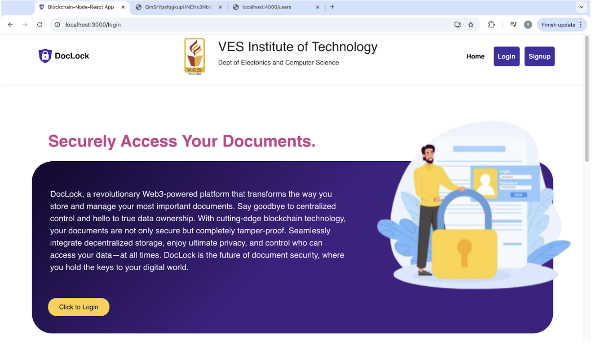
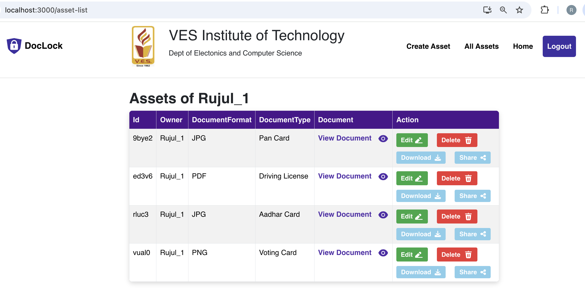
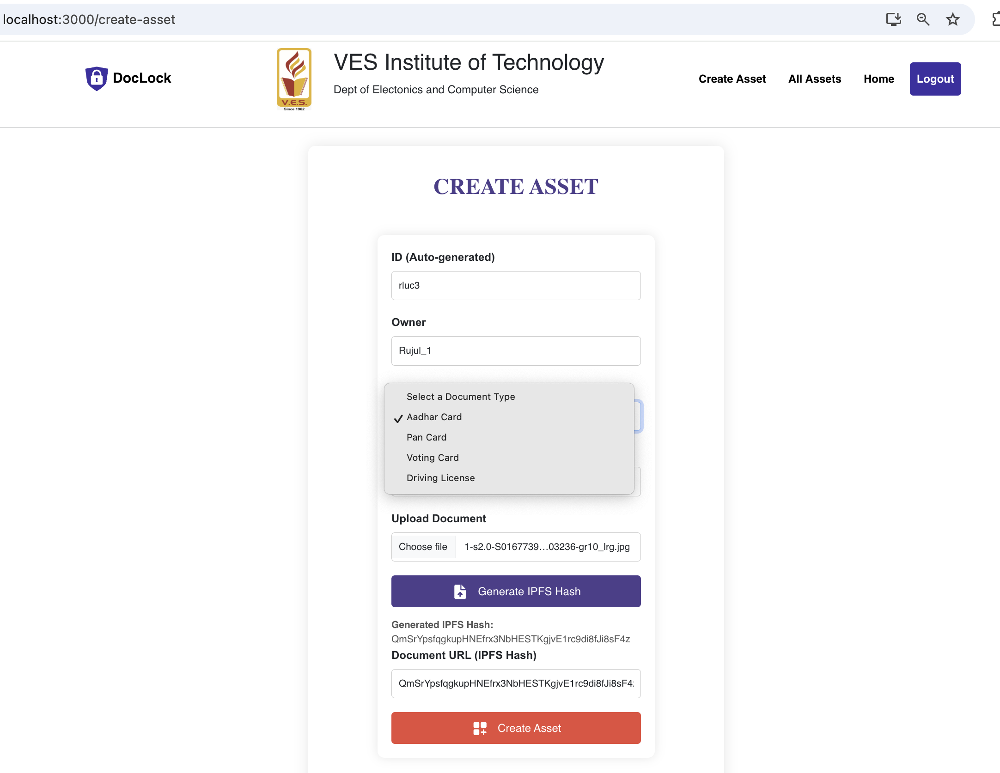
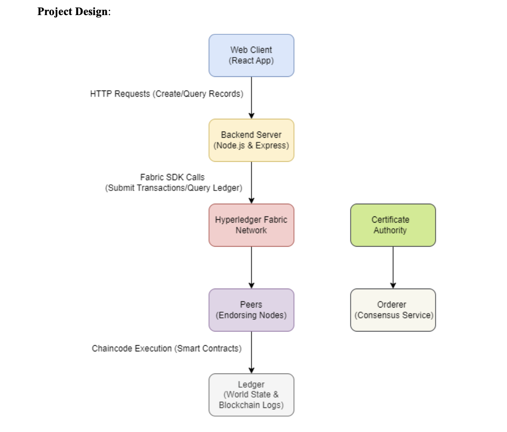

## Overview
DocLock is an innovative document storage platform designed to provide a secure and efficient solution for storing, managing, and verifying important documents using blockchain technology. In today’s digital age, data security and privacy are paramount, especially when dealing with sensitive information. DocLock addresses these concerns by employing a decentralized ledger system, which ensures that documents are not only securely stored but also immutable and verifiable.



### Key Features:
- **Decentralized Storage**: Unlike traditional document storage solutions, which rely on centralized servers, DocLock leverages blockchain technology to distribute document storage across a network of nodes. This decentralization enhances security by eliminating single points of failure and making unauthorized access virtually impossible.
  
- **Document Verification**: Each document stored in DocLock is hashed and recorded on the blockchain, creating a unique digital fingerprint. This allows users to verify the authenticity of documents easily, providing peace of mind that their information has not been altered or tampered with.

- **User-Centric Control**: Users retain full control over their documents. With the ability to grant or revoke access permissions, DocLock ensures that sensitive information is only available to authorized individuals. This user-centric approach promotes trust and confidentiality.

- **Enhanced Privacy**: Built with privacy in mind, DocLock employs advanced encryption techniques to protect user data. Even in a decentralized environment, users can be confident that their documents are safe from unauthorized access and breaches.

- **Robust Document Management**: The platform is designed to streamline the process of document management. Users can easily upload, store, and retrieve documents while maintaining an organized and user-friendly interface.

DocLock aims to revolutionize the way individuals and organizations manage sensitive documents by providing a reliable, secure, and user-friendly solution that adapts to the evolving needs of today's digital landscape.




## The asset transfer basic sample demonstrates:

- Connecting a client application to a Fabric blockchain network.
- Submitting smart contract transactions to update ledger state.
- Evaluating smart contract transactions to query ledger state.
- Handling errors in transaction invocation.

## About the sample

This sample includes smart contract and application code in multiple languages. This sample shows create, read, update, transfer and delete of an asset.

For a more detailed walk-through of the application code and client API usage, refer to the [Running a Fabric Application tutorial](https://hyperledger-fabric.readthedocs.io/en/latest/write_first_app.html) in the main Hyperledger Fabric documentation.

### Application

Follow the execution flow in the client application code, and corresponding output on running the application. Pay attention to the sequence of:

- Transaction invocations (console output like "**--> Submit Transaction**" and "**--> Evaluate Transaction**").
- Results returned by transactions (console output like "**\*\*\* Result**").

### Smart Contract

The smart contract (in folder `chaincode-xyz`) implements the following functions to support the application:

- CreateAsset
- ReadAsset
- UpdateAsset
- DeleteAsset
- TransferAsset

Note that the asset transfer implemented by the smart contract is a simplified scenario, without ownership validation, meant only to demonstrate how to invoke transactions.



## Running the sample

The Fabric test network is used to deploy and run this sample. Follow these steps in order:

1. Create the test network and a channel (from the `test-network` folder).
   ```
   ./network.sh up createChannel -c mychannel -ca
   ```

1. Deploy one of the smart contract implementations (from the `test-network` folder).
   ```
   # To deploy the  chaincode implementation
   ./network.sh deployCC -ccn basic -ccp ../asset-transfer-basic/chaincode-javascript/ -ccl javascript
   ```

1. Run the application (from the `asset-transfer-basic` folder).
   ```
   # To run the Typescript sample application
   cd application-gateway-typescript
   npm install
   npm start

   # To run the Go sample application
   cd application-gateway-go
   go run .

   # To run the Java sample application
   cd application-gateway-java
   ./gradlew run
   ```

## Clean up

When you are finished, you can bring down the test network (from the `test-network` folder). The command will remove all the nodes of the test network, and delete any ledger data that you created.

```
./network.sh down
```

## Project Model 



## Prerequisites

To get the most out of this guide, you should have:
- **Basic understanding of blockchain technology**
- Familiarity with **Docker** and **Kubernetes** for container management
- **Command-line interface** knowledge
- Experience with **Node.js** and/or **Go** programming (for chaincode development)

---

## Learning Path

1. **Blockchain Fundamentals** - Review the basics of blockchain and permissioned networks.
2. **Hyperledger Fabric Architecture** - Study the components, such as peers, orderers, channels, and MSPs.
3. **Development Setup** - Install required tools and set up the Fabric samples.
4. **Smart Contract Development** - Write, deploy, and manage chaincode.
5. **Building DApps** - Connect a decentralized application to interact with Hyperledger Fabric.
6. **Advanced Topics** - Explore multi-organization networks, security, and consensus mechanisms.

---

[//]: # (SPDX-License-Identifier: CC-BY-4.0)

# Hyperledger Fabric Samples : Learning Guide

You can use Fabric samples to get started working with Hyperledger Fabric, explore important Fabric features, and learn how to build applications that can interact with blockchain networks using the Fabric SDKs. To learn more about Hyperledger Fabric, visit the [Fabric documentation](https://hyperledger-fabric.readthedocs.io/en/latest).

Note that this branch contains samples for the latest Fabric release. For older Fabric versions, refer to the corresponding branches:

- [release-2.2](https://github.com/hyperledger/fabric-samples/tree/release-2.2)
- [release-1.4](https://github.com/hyperledger/fabric-samples/tree/release-1.4)

## Getting started with the Fabric samples

To use the Fabric samples, you need to download the Fabric Docker images and the Fabric CLI tools. First, make sure that you have installed all of the [Fabric prerequisites](https://hyperledger-fabric.readthedocs.io/en/latest/prereqs.html). You can then follow the instructions to [Install the Fabric Samples, Binaries, and Docker Images](https://hyperledger-fabric.readthedocs.io/en/latest/install.html) in the Fabric documentation. In addition to downloading the Fabric images and tool binaries, the Fabric samples will also be cloned to your local machine.

## Test network

The [Fabric test network](test-network) in the samples repository provides a Docker Compose based test network with two
Organization peers and an ordering service node. You can use it on your local machine to run the samples listed below.
You can also use it to deploy and test your own Fabric chaincodes and applications. To get started, see
the [test network tutorial](https://hyperledger-fabric.readthedocs.io/en/latest/test_network.html).

The [Kubernetes Test Network](test-network-k8s) sample builds upon the Compose network, constructing a Fabric
network with peer, orderer, and CA infrastructure nodes running on Kubernetes.  In addition to providing a sample
Kubernetes guide, the Kube test network can be used as a platform to author and debug _cloud ready_ Fabric Client
applications on a development or CI workstation.


## Asset transfer samples and tutorials

The asset transfer series provides a series of sample smart contracts and applications to demonstrate how to store and transfer assets using Hyperledger Fabric.
Each sample and associated tutorial in the series demonstrates a different core capability in Hyperledger Fabric. The **Basic** sample provides an introduction on how
to write smart contracts and how to interact with a Fabric network using the Fabric SDKs. The **Ledger queries**, **Private data**, and **State-based endorsement**
samples demonstrate these additional capabilities. Finally, the **Secured agreement** sample demonstrates how to bring all the capabilities together to securely
transfer an asset in a more realistic transfer scenario.

|  **Smart Contract** | **Description** | **Tutorial** | **Smart contract languages** | **Application languages** |
| -----------|------------------------------|----------|---------|---------|
| [Basic](asset-transfer-basic) | The Basic sample smart contract that allows you to create and transfer an asset by putting data on the ledger and retrieving it. This sample is recommended for new Fabric users. | [Writing your first application](https://hyperledger-fabric.readthedocs.io/en/latest/write_first_app.html) | Go, JavaScript, TypeScript, Java | Go, TypeScript, Java |
| [Ledger queries](asset-transfer-ledger-queries) | The ledger queries sample demonstrates range queries and transaction updates using range queries (applicable for both LevelDB and CouchDB state databases), and how to deploy an index with your chaincode to support JSON queries (applicable for CouchDB state database only). | [Using CouchDB](https://hyperledger-fabric.readthedocs.io/en/latest/couchdb_tutorial.html) | Go, JavaScript | Java, JavaScript |
| [Private data](asset-transfer-private-data) | This sample demonstrates the use of private data collections, how to manage private data collections with the chaincode lifecycle, and how the private data hash can be used to verify private data on the ledger. It also demonstrates how to control asset updates and transfers using client-based ownership and access control. | [Using Private Data](https://hyperledger-fabric.readthedocs.io/en/latest/private_data_tutorial.html) | Go, TypeScript, Java | TypeScript |
| [State-Based Endorsement](asset-transfer-sbe) | This sample demonstrates how to override the chaincode-level endorsement policy to set endorsement policies at the key-level (data/asset level). | [Using State-based endorsement](https://github.com/hyperledger/fabric-samples/tree/main/asset-transfer-sbe) | Java, TypeScript | JavaScript |
| [Secured agreement](asset-transfer-secured-agreement) | Smart contract that uses implicit private data collections, state-based endorsement, and organization-based ownership and access control to keep data private and securely transfer an asset with the consent of both the current owner and buyer. | [Secured asset transfer](https://hyperledger-fabric.readthedocs.io/en/latest/secured_asset_transfer/secured_private_asset_transfer_tutorial.html)  | Go | TypeScript |
| [Events](asset-transfer-events) | The events sample demonstrates how smart contracts can emit events that are read by the applications interacting with the network. | [README](asset-transfer-events/README.md)  | Go, JavaScript, Java | Go, TypeScript, Java |
| [Attribute-based access control](asset-transfer-abac) | Demonstrates the use of attribute and identity based access control using a simple asset transfer scenario | [README](asset-transfer-abac/README.md)  | Go | _None_ |

## Full stack asset transfer guide

The [full stack asset transfer guide](full-stack-asset-transfer-guide#readme) workshop demonstrates how a generic asset transfer solution for Hyperledger Fabric can be developed and deployed. This covers chaincode development, client application development, and deployment to a production-like environment.

## Additional samples

Additional samples demonstrate various Fabric use cases and application patterns.

|  **Sample** | **Description** | **Documentation** |
| -------------|------------------------------|------------------|
| [Off chain data](off_chain_data) | Learn how to use block events to build an off-chain database for reporting and analytics. | [Peer channel-based event services](https://hyperledger-fabric.readthedocs.io/en/latest/peer_event_services.html) |
| [Token SDK](token-sdk) | Sample REST API around the Hyperledger Labs [Token SDK](https://github.com/hyperledger-labs/fabric-token-sdk) for privacy friendly (zero knowledge proof) UTXO transactions. | [README](token-sdk/README.md) |
| [Token ERC-20](token-erc-20) | Smart contract demonstrating how to create and transfer fungible tokens using an account-based model. | [README](token-erc-20/README.md) |
| [Token UTXO](token-utxo) | Smart contract demonstrating how to create and transfer fungible tokens using a UTXO (unspent transaction output) model. | [README](token-utxo/README.md) |
| [Token ERC-1155](token-erc-1155) | Smart contract demonstrating how to create and transfer multiple tokens (both fungible and non-fungible) using an account based model. | [README](token-erc-1155/README.md) |
| [Token ERC-721](token-erc-721) | Smart contract demonstrating how to create and transfer non-fungible tokens using an account-based model. | [README](token-erc-721/README.md) |
| [High throughput](high-throughput) | Learn how you can design your smart contract to avoid transaction collisions in high volume environments. | [README](high-throughput/README.md) |
| [Simple Auction](auction-simple) | Run an auction where bids are kept private until the auction is closed, after which users can reveal their bid. | [README](auction-simple/README.md) |
| [Dutch Auction](auction-dutch) | Run an auction in which multiple items of the same type can be sold to more than one buyer. This example also includes the ability to add an auditor organization. | [README](auction-dutch/README.md) |


## License <a name="license"></a>

Hyperledger Project source code files are made available under the Apache
License, Version 2.0 (Apache-2.0), located in the [LICENSE](LICENSE) file.
Hyperledger Project documentation files are made available under the Creative
Commons Attribution 4.0 International License (CC-BY-4.0), available at http://creativecommons.org/licenses/by/4.0/.

